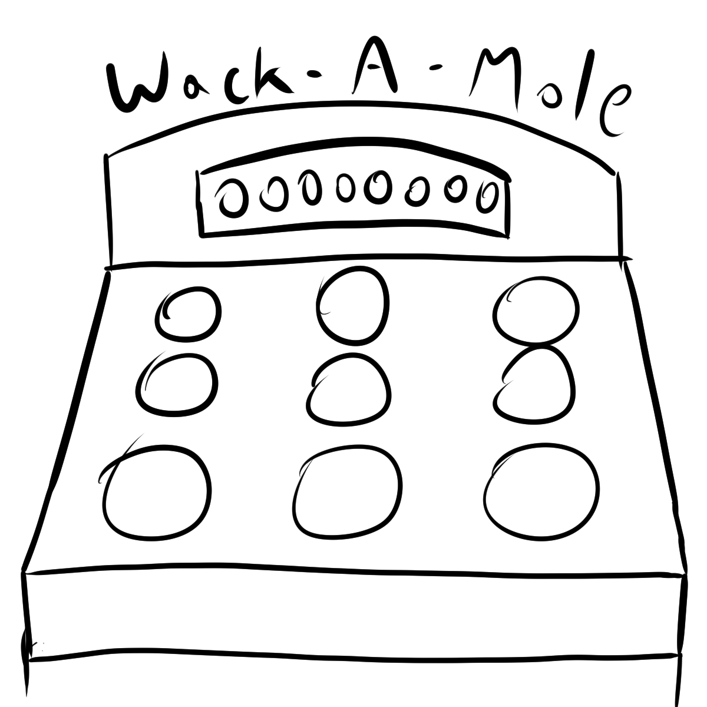

:warning: Everything between << >> needs to be replaced (remove << >> after replacing)

# Andrew Liu's Final Project
## CS110 Final Project  Spring 2024

## Team Members

Andrew Liu

***

## Project Description

A Whack-A-Mole Game. Players will be timed on their ability to hit a target when it appears on the screen. Points are generated by what they hit and how long it took them to hit it.

***    

## GUI Design

### Initial Design

### Final Design

## Program Design

### Features

1. Starting Menu
2. Click-based game
3. Points system
4. Difficulty level
5. Game end screen

### Classes

- << You should have a list of each of your classes with a description >>

## ATP
### Score
| Step                 |Procedure             |Expected Results                   |
|----------------------|:--------------------:|----------------------------------:|
|  1                   | Start game           | Game starts     |
|  2                   | Score Counter Program  |Score count = 0  |
|  3                   | Hit count button   | hit count increases = 1      |
|  4                   | Hit equation   | Score increases to expected score after hit|
### Mole
| Step                 |Procedure             |Expected Results                   |
|----------------------|:--------------------:|----------------------------------:|
|  1                   | Start game           | Game starts |
|  2                   | Moles start appearing   | Moles pop out of one of nine holes   |
|  3                   | Click on the mole  | Mole is gone and hit counter adds|
|  4                   | Don't click on mole | Mole disappears after selected seconds |
### Timer
| Step                 |Procedure             |Expected Results                   |
|----------------------|:--------------------:|----------------------------------:|
|  1                   | Start game           | Timer starts    |
|  2                   | Timer goes down by waiting  | Timer decreases per second  |
|  3                   | Wait for time to hit 0 | Game should stop and display final score|
### Menu Navigation
| Step                 |Procedure             |Expected Results                   |
|----------------------|:--------------------:|----------------------------------:|
|  1                   | Start game           | Menu appears    |
|  2                   | Click difficulty choice | Game starts with proper difficulty settings  |
|  3                   | Click quit button       | Game closes the program|
### Error
| Step                 |Procedure             |Expected Results                   |
|----------------------|:--------------------:|----------------------------------:|
|  1                   | Start game           | Game starts   |
|  2                   | Any invalid inputs during game | Game does not crash or break  |
|  3                   | Error detected      | Game shows error message |